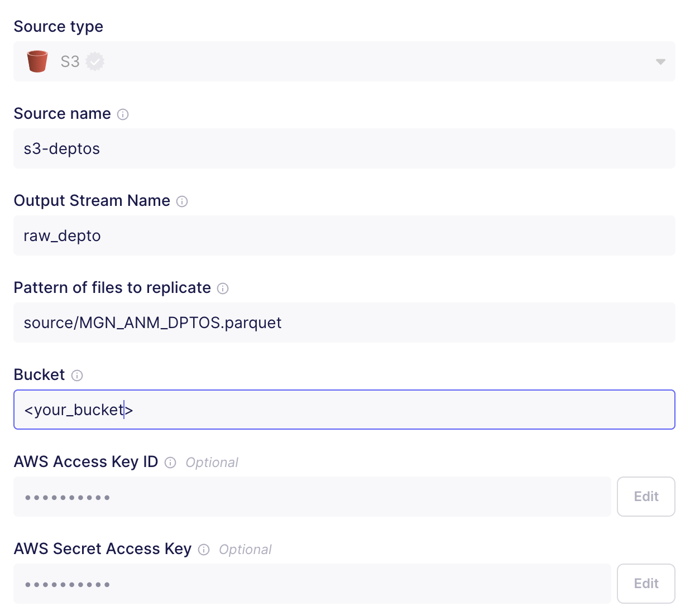
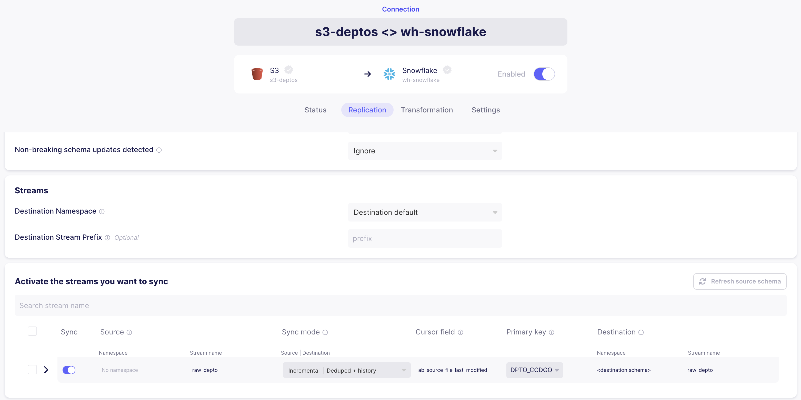
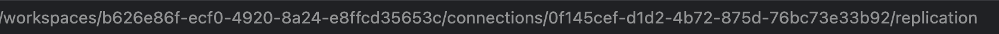
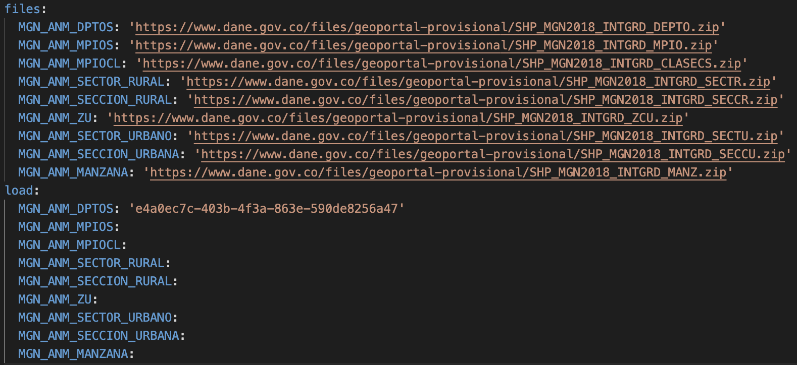
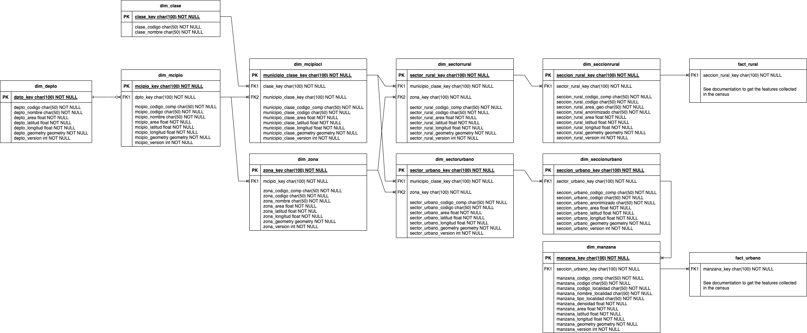

# Introduction

One of the main challenges in countries like Colombia is getting access to basic statistics about regions, including internet access, income distribution, type of house, among others. The National Bureau of Statistics (DANE) has made a big effort to collect the data through different mechanisms, including the last census in the country in 2.018. However, the data is not widely known anda available by the public, therefore, this project is a first attempt to build a pipeline to get the raw data and transform it so anyone interested in the data of the country can replicate the process. Some use cases include:

1. General market research
2. Risk assessment
3. Design of public policy
4. Financial inclusion
5. Design of products and services

This pipeline is built completely in the cloud using technologies such as dbt, Sbowflake, Preset, among others. As part of this work, the objective is to encourage the usage of those tools in the country, understanding how the technology and data engineering could be a factor to transform the reality of the Colombian people.

# Data Structure

The Bureau of Statistics provide a complete guide of the data collected in the census. The documentation is available in Spanish in the [DANE Website](https://www.dane.gov.co/files/geoportal-provisional/MGN2018_Integrado_CNPV2018_InstructivoUso.pdf). In summary, there are nine levels of data available to process:

1. State level
2. Town level
3. Type of town
4. Type of zone
5. Rural sector
6. Rural section
7. Urban sector
8. Urban section
9. Block level

Please check the documentation available to understand the administrative division in Colombia. A brief summary is provided [here](https://en.wikipedia.org/wiki/Administrative_divisions_of_Colombia)


# Installation

## Requirements

This solution is based entirely on cloud-native solutions, so before running the code, make sure that you have accounts with the level of access required to use the tools. See below the components required and some references that can help you to configure your environment:

1. AWS Account
    - Creating a new account (https://portal.aws.amazon.com/billing/signup#/start/email)
    - Setting a new user with access and secret keys (https://docs.aws.amazon.com/powershell/latest/userguide/pstools-appendix-sign-up.html)
    - Granting permissions to S3 (https://docs.aws.amazon.com/config/latest/developerguide/s3-bucket-policy.html)
2. Airbyte
    - Installing Airbyte using docker (https://docs.airbyte.com/deploying-airbyte/local-deployment/)
3. Snowflake
    - Creating a new account (https://signup.snowflake.com/)
    - In order to help you to set up your Snowflake account, a script is provided to create the users and databases required for this project. See the installation folder.
4. dbt
    - Installing dbt with Python - See Snowflake account (https://docs.getdbt.com/docs/core/pip-install)
    - Setting a Snowflake access (https://docs.getdbt.com/docs/quickstarts/dbt-cloud/snowflake)
5. Preset
    - Creating a new account (https://manage.app.preset.io/starter-registration/)
    - Setting a Snowflake access (https://docs.preset.io/docs/snowflake)

## Configuring Airbyte

After setting you Airbyte account, you need to config a connection process. See below the step-by-step to configure your extract process.

### Source

Given the structure of the data, it is necessary to configure an extraction process for every layer, so this process needs to be replicated nine times to process the data available. In the Airbyte GUI, please select a S3 connection and configure it as presented below:



The recommendation in any case is to create nine conections with the following names and patterns to replicate:

1. s3-deptos -source/MGN_ANM_DPTOS.parquet-
2. s3-mcipios -source/MGN_ANM_MPIOS.parquet-
3. s3-mcipiocls -source/MGN_ANM_MPIOCL.parque-
4. s3-zurbs -source/MGN_ANM_ZU.parquet-
5. s3-setrural -source/MGN_ANM_SECTOR_RURAL.parquet-
6. s3-secrural -source/MGN_ANM_SECCION_RURAL.parquet-
7. s3-seturbano -source/MGN_ANM_SECTOR_URBANO.parquet-
8. s3-securbano -source/MGN_ANM_SECCION_URBANA.parquet-
9. s3-manzanas -source/MGN_ANM_MANZANA.parquet-

### Destination

The destination just need to be configured once. Just follow the guide below.


### Connection

Finally, it is necessary to configure the connection flow. In this case, it is configured a Deduped process, so every time that the national authority issues more data through a new census or any administrative change, the data is refreshed witout losing the history.

In this case, it is required to configured a flow for every file extracted. The configuration should look like is presented below



See below the suggested keys to configure your process.

1. s3-deptos -DPTO_CCDGO-
2. s3-mcipios -MPIO_CDPMP-
3. s3-mcipiocls -MPIO_CLASE-
4. s3-zurbs -ZU_CDIVI-
5. s3-setrural -SETR_CCNCT-
6. s3-secrural -SECR_CCNT-
7. s3-seturbano -SETU_CCNT-
8. s3-securbano -SECU_CCNT-
9. s3-manzanas -COD_DANE_A-

## Configuring the pipeline files

In order to run the pipeline, it is just necessary to configure the YAML file and Config file.

### Config file

The config file contains the environment variables to run the pipeline. A config template is provided as part of the project. Just include the next variables:

- s3_access_key
- s3_secret_key
- s3_aws_region
- s3_bucket
- airbyte_server
- airbyte_auth

### YAML File

The YAML file contains some parameters required to run the pipeline. The first part includes the URLs of the files to obtain them directly from the Bureau of Statistics. Don't change them unless new information is available. The second part contains the id of every process in Airbyte. In any process take the id from URL as presented below:



And later, paste it in the YAML file.



And you're ready to extract and load the data!

## Running the pipeline

Finally, to run the pipeline, just set the config files and run the script :-)

```
. /config.sh
python pypeline.sh
```

## Creating the dimensional model

The original files do not have any structure or relationship between them so it could be a little bit confusing to work with the data. For this reason, the raw data is transformed to obtain a better structure. Following the administrative division, see the ER model that you can use to query the data.

 

To build the model, a folder named datamodel is provided with a dbt project configured. Just run the model using this command

```
dbt build
```

With the model, you are ready to go! Enjoy the data and get more insights about Colombia!